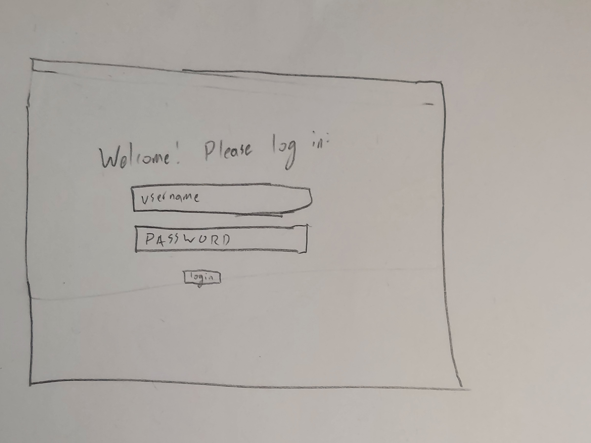
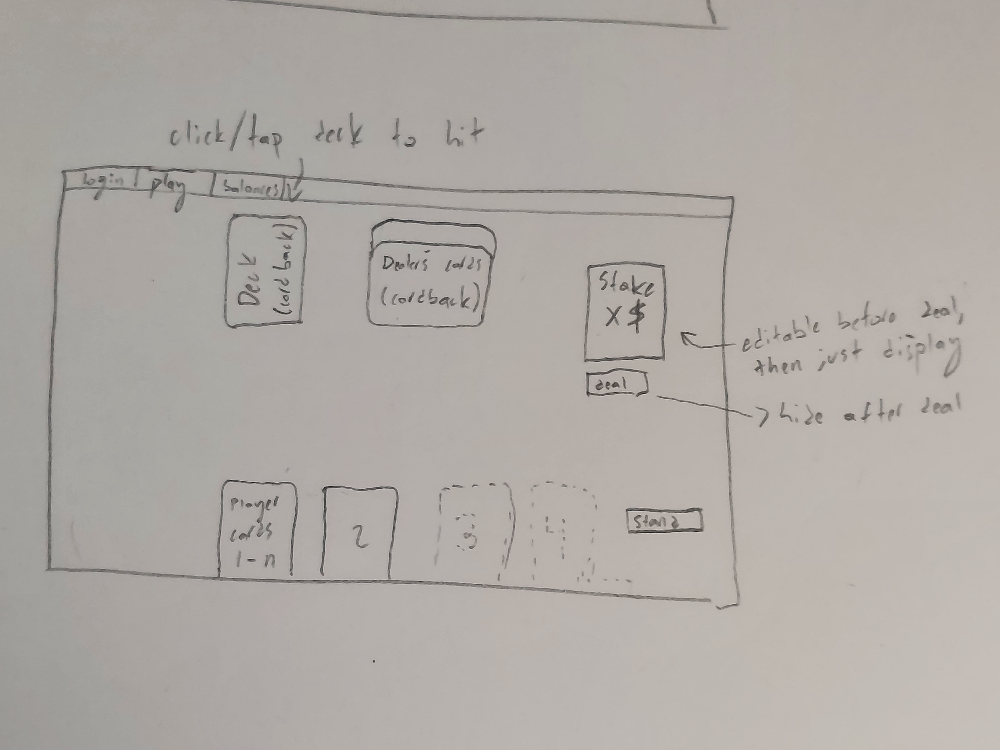
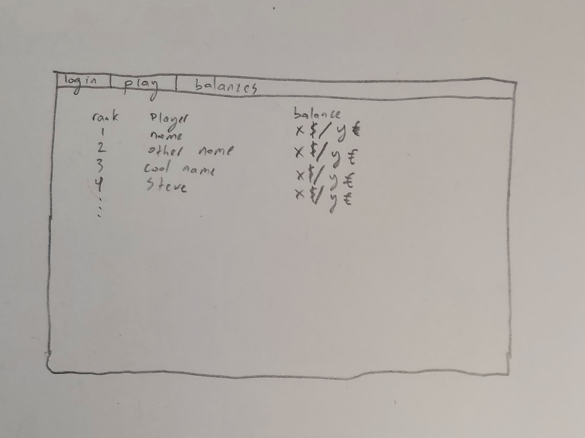

# 21 to go
core assignment for CS 260 
edited from development machine to verify git is configured correctly

### Elevator pitch

Browser-based games have become a ubiquitous form of entertainment, but anyone who's played one knows that generally, these games are designed to get you to spend as much time as possible online - which is the opposite of their ideal niche! The advantage of a browser game is that you can play easily from anywhere, so you can fill spare minutes in a long line or waiting for a train. This target means that a game should be simple, should not rely on other users being online, and, ideally, should be mentally demanding - keeping you attentive during the breaks in your schedule, not anesthetizing you. I propose the longstanding individual strategy game twenty-one, or blackjack, played against an automated dealer and tracking scores to show your progress and compete with friends. 

### Design
The three basic pages of 21 to go will be laid out as follows:\
Login:

Gameplay:

Balance sheet:

### Key features

- Secure login over HTTPS
- Ability to choose a 'stake' for each round
- Elegant, simple presentation of the classic game of Blackjack
- one-button interface for the core strategy choice of the game, Hit or Stand.
- Balance sheet showing the balance (aggregate score) of all players
- Your balance caps the stake for each round
- Results are persistently stored
- Notification whenever someone passes you on the balance sheet
  
### Technologies

I am going to use the required technologies in the following ways.

- **HTML** - Uses correct HTML structure for application. Three HTML pages. One for login, one to play (including starting the game) and one for the balance sheet. Hyperlinks to choice artifact.
- **CSS** - Application styling that looks good on different screen sizes, uses good darkspace, color choice and contrast.
- **JavaScript** - Provides login, game setup, gameplay interaction, and backend endpoint calls.
- **Service** - Backend service with endpoints for:
  - login
  - retrieving balance information
  - playing a game (and recording the results)
  - use third-party server for conversion rate to show euro values along with dollar values on the balance sheet
- **DB/Login** - Store users and balances in database. Register and login users. Credentials securely stored in database. Can't play unless authenticated, can't wager more than current balance.
- **WebSocket** - When your balance passes another user's, that user is notified. Defend your spot!
- **React** - Application ported to use the React web framework.

## HTML Deliverable
For this deliverable I built out the structure of my application using HTML.

- **HTML pages** - Three HTML pages that represent the ability to login, play blackjack, and view player balances.
- **Links** - Each page links to each other page in the header. 
- **Text** - Text indicates how to login and hit (ask for another card from dealer). The application does not call for much text.
- **Images** - Cardback images for the deck and house's cards are implemented. Same image is used as a placeholder for the player's cards, too - will be replaced once the application supports giving them actual cards.
- **DB/Login** - Username and Password boxes with submit button for login. Scores shows different users' balances from the database.
- **WebSocket** - Users are notified in real time on play and scores pages when another user wins or loses a game. 
- **Third Party Calls** - Balance sheet will use a third-party service to get conversion rate when showing values in Euros.

## CSS Deliverable
For this deliverable I gave the website style using CSS

- Header, footer, and main content body
- **Navigation elements** - Links are now in header, with their background highlighting to show hover and style consistent with the look of the application
- **Responsive to window resizing** - My app looks tolerable on all window sizes and devices - elements are spaced using flexboxes, and the navigation bar shrinks font and removes uneccessary elements if the screen is too small to show all three links.
- **Application elements** - Used contrast and whitespace (well, ok, greyspace - you get the idea).
- **Application text content** - Font is explicitly set on all pages, and is sized appropriately for different usages (I like serifs don't @ me)
- **Application images** - Images are scaled so that they will appropriately almost-fill the screen on the image heavy page, and are positioned appropriately to see the deck at the top, then the house's cards, with the players cards at the bottom. The card back images are still mocks; actual cards will be used for the players hand once the javascript is complete.

## JavaScript deliverable

For this deliverable I implemented my JavaScript so that the application works for a single user. I also added placeholders for future technology.

- **login** - Using the login or sign up buttons will take you to the play page and save your username and password (in the future, will actually login). Username is displayed on the topbar of the site. 
- **database** - Balance page uses a json string to mock data requested from database, dynamically putting it in the table. 
- **WebSocket** - I used the setInterval function to periodically mock another user winning or losing a game on the balance page. This will be replaced with WebSocket messages later.
- **application logic** - the game of 21 is fully playable and shows the game state through images and text. It follows a simplified version of casino rules.  

## Service Deliverable
For this deliverable I added backend endpoints that receives votes and returns the voting totals, as well as a placeholder third-party endpoint.

- **Node.js/Express HTTP service** - done!
- **Static middleware for frontend** - done!
- **Calls to third party endpoints** - I realized at the last moment that my plan might not technically meet the rules (the API I'm looking at has limited request frequency, so I would need to call that endpoint from the backend and cache it - but the requirements say that your _frontend_ must call to third party endpoints.) I have a simple call to the picture api to meet this requirement until I can talk to the professor about whether my plan needs to change, so this requirement is _done._
- **Backend service endpoints** - Endpoints for retrieving balance sheet from server and reporting a game result (and score adjustment) to the server. 
- **Frontend calls service endpoints** - I did this using the fetch function.

## Login Deliverable

- MongoDB Atlas database created - done!
- Stores data in MongoDB - done!
- User registration - Creates a new account in the database.
- existing user - login to an account to allow you to wager more points, up to the account's current score.
- Use MongoDB to store credentials - Stores user and their score.
- Restricts functionality - You cannot play the game unless logged in, and cannot update a user's score unless you're logged in as that user. 

